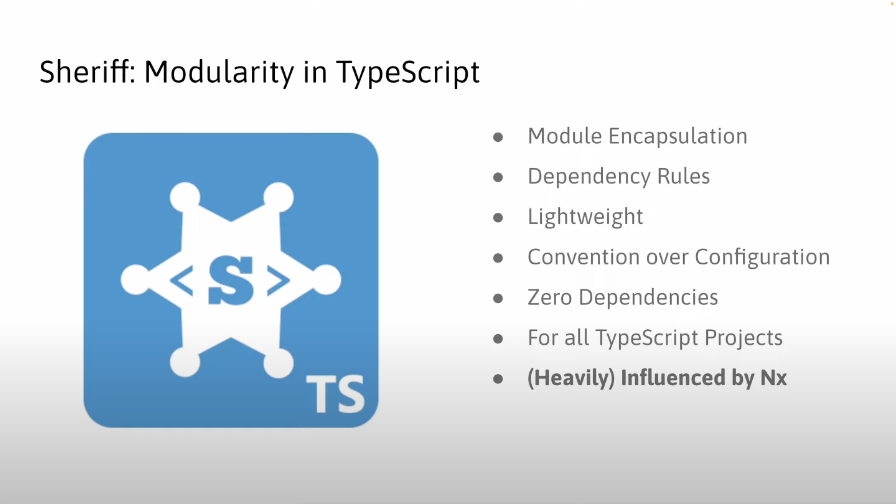

# Sheriff

https://github.com/softarc-consulting/sheriff

This project was generated with [Angular CLI](https://github.com/angular/angular-cli) version 17.1.0.

## Development server

Run `ng serve` for a dev server. Navigate to `http://localhost:4200/`. The application will automatically reload if you change any of the source files.

## Code scaffolding

Run `ng generate component component-name` to generate a new component. You can also use `ng generate directive|pipe|service|class|guard|interface|enum|module`.

## Build

Run `ng build` to build the project. The build artifacts will be stored in the `dist/` directory.

## Running unit tests

Run `ng test` to execute the unit tests via [Karma](https://karma-runner.github.io).

## Running end-to-end tests

Run `ng e2e` to execute the end-to-end tests via a platform of your choice. To use this command, you need to first add a package that implements end-to-end testing capabilities.

## Further help

To get more help on the Angular CLI use `ng help` or go check out the [Angular CLI Overview and Command Reference](https://angular.io/cli) page.

## DDD (Domain-Driven-Design)

A categorization of these modules increases clarity. Nrwl suggests the following categories (originally for libraries), among others, which have proven helpful in our daily work:

> `feature`: A feature module implements a use case (or a technical feature) with so-called smart components. Due to their focus on a feature, such components are not very reusable. Smart Components communicate with the backend. Typically, in Angular, this communication occurs through a store or services.

> `ui`: UI modules contain so-called dumb or presentational components. These are reusable components that support the implementation of individual features but do not know them directly. The implementation of a design system consists of such components. However, UI modules can also contain general technical components that are used across all use cases. An example of this would be a ticket component, which ensures that tickets are presented in the same way in different features. Such components usually only communicate with their environment via properties and events. They do not get access to the backend or a store.

> `data`: Data modules contain the respective domain model (actually the client-side view of it) and services that operate on it. Such services validate e.g. Entities and communicating with the backend. State management, including the provision of view models, can also be accommodated in data modules. This is particularly useful when multiple features in the same domain are based on the same data.

> `util`: General helper functions etc. can be found in utility modules. Examples of this are logging, authentication or working with date values.

## Sheriff

